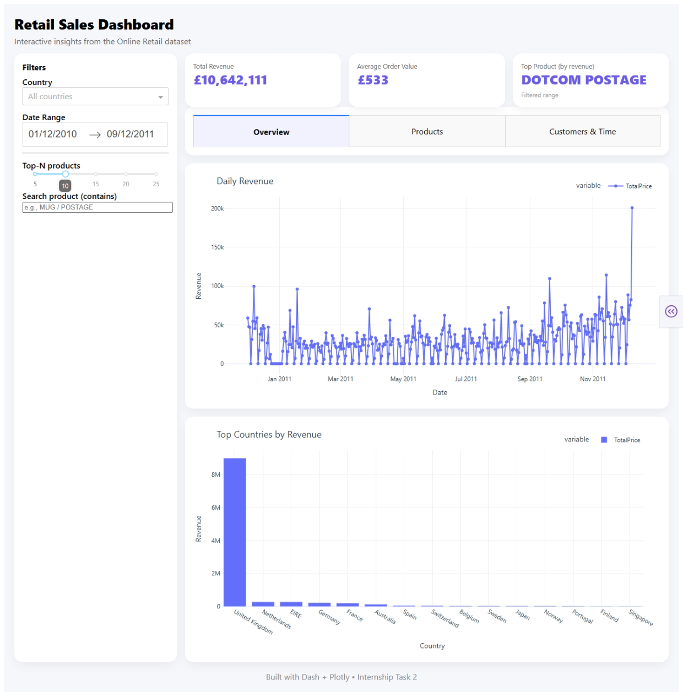
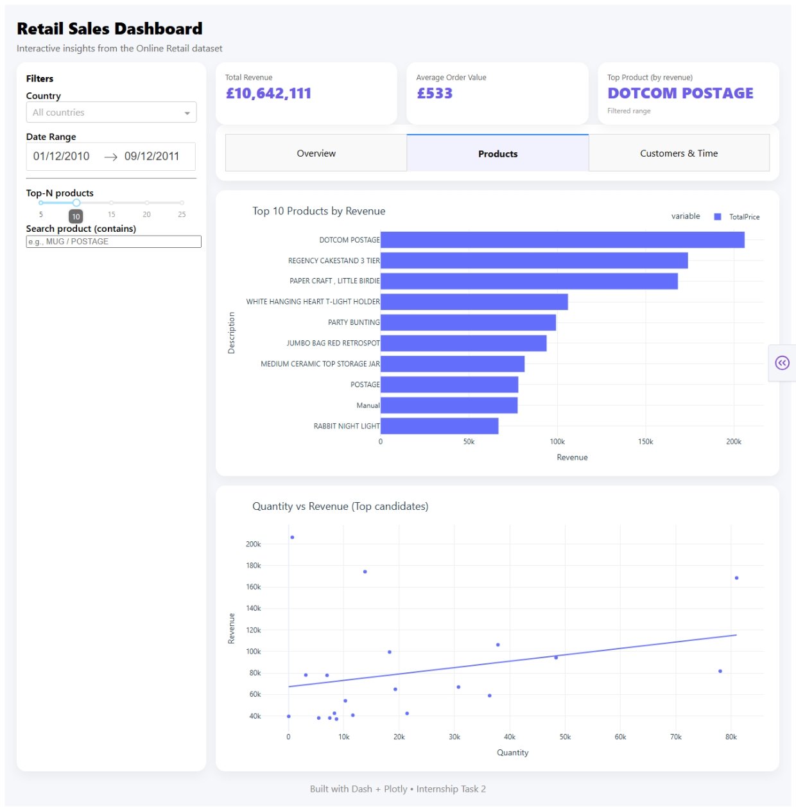
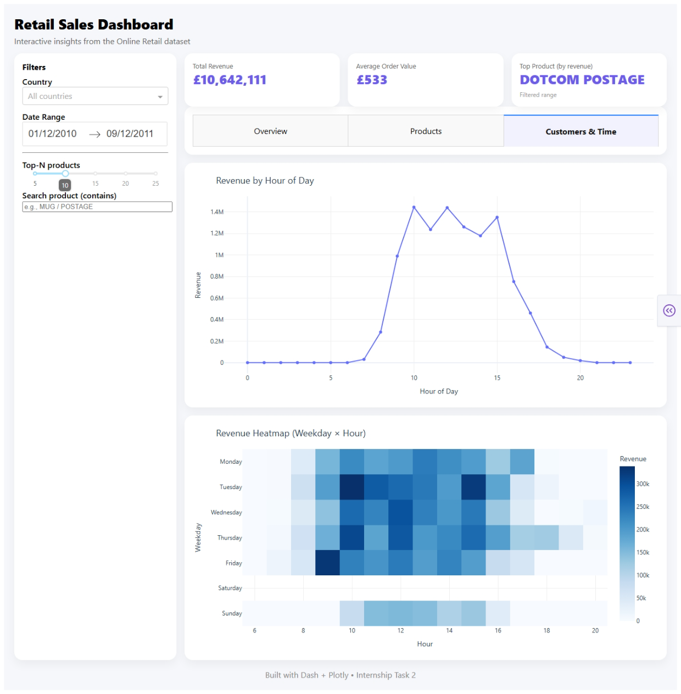

Task 2: Visualizing for Impact
📌 Project Overview

The goal of this task is to create an interactive dashboard to effectively visualize key insights from the exploratory data analysis (EDA) done in Task 1. The purpose is to communicate findings in a clean and understandable way for a non-technical audience.

⚙️ Steps Performed

Select Key Metrics

Chose the most important insights from Task 1 for the dashboard, including metrics such as:

Top-selling products

Sales by country

Peak shopping hours

Build a Dashboard

Used tools like Plotly, Dash, or Google Data Studio to build the interactive dashboard.

Displayed key insights with appropriate charts (e.g., bar charts, pie charts, line graphs).

Interactivity

Added interactive features, such as:

Dropdown menus to filter data by country or product category.

Interactive charts where users can hover or click for more details.

Presentation

Ensured the dashboard was:

Well-labeled with clear titles, axis names, and legends.

Visually appealing with color schemes and layout to improve user experience.

Clear storytelling to convey the insights effectively.

How to Run

Install the required libraries:

pip install plotly dash pandas

Open the app.py file and Run "python app.py"

Expected Output

Interactive Dashboard: A Image of Dashboard showcasing key metrics like:

Top-selling products

Sales by country

Peak shopping hours

